### Increase pattern encoding limit: You can now encode patterns with input/output amounts of up to MAX_LONG(2^63 -1)

### Highlight stacks from crafting status screen: You can now shift click any stacks in the crafting status screen to highlight the corresponding pattern provider(works with pattern buffers)
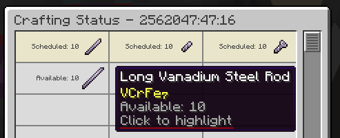
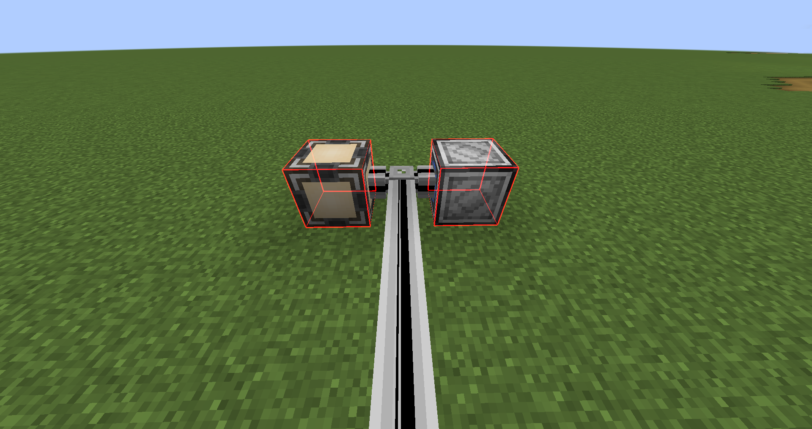

### Upped the craft request limit to MAX_LONG(2^63 - 1)  
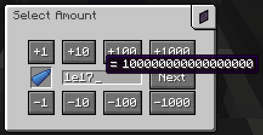
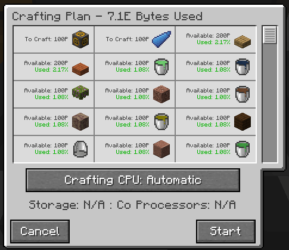
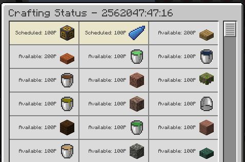

### Message a player when a craft finishes: Whenever a craft finishes, if you have the notify for finished crafts setting enabled, or opted to follow the craft when you started it, you'll get a message in chat telling you the amount(rounded, hover for exact figure) and the time it took to complete
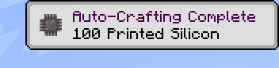

### Ability to start craft with follow(opt-out, see above for description)
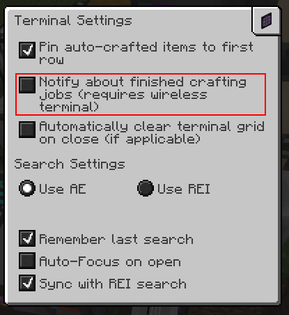
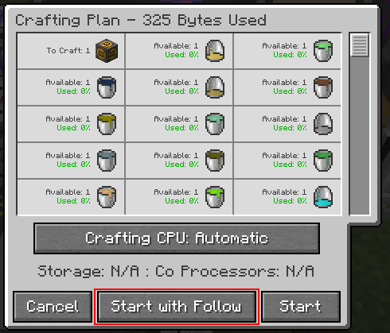

### Singularity crafting storage(MAX_LONG crafting storage)
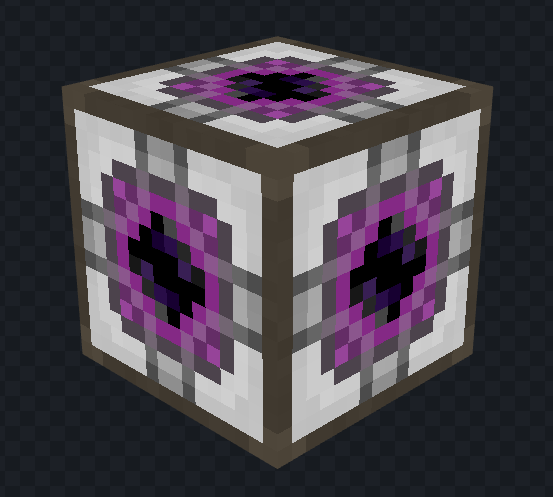
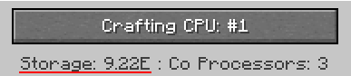

### Auto complete card for pattern providers: Once all inputs from the pattern have been pushed, the corresponding craft will automatically be marked as finished, useful for multiblock patterns!

### Suspend crafting jobs: this will pause any crafting process and stop pattern providers from pushing out new stacks
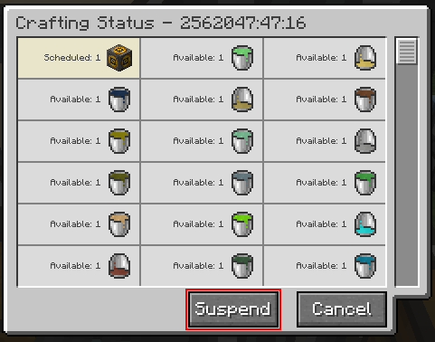

### Ability to change max controller size via config
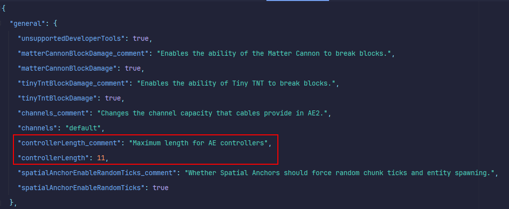

### Crafting terminal can reuse old items in its matrix, good for crafting with gt tools

### Ability to sort stacks via registry id
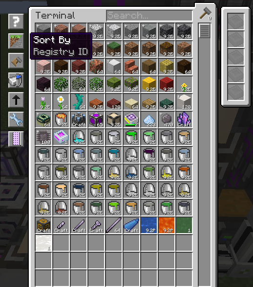

### Craft amount menu shows 1, 16, 32 and 64 while holding either shift or ctrl
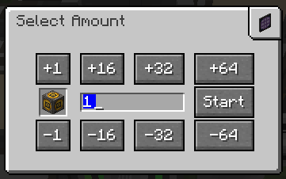

extra blocking modes for pattern provider(default, full, smart)
### Default: This is the default blocking mode, it will push the pattern if the connected storage does not contain any of the pattern inputs in this Pattern Provider, if the storage contains anything that is not a pattern input, the blocking mode will skip it and still push the pattern.
### Full: This blocking mode will not push the pattern if the connected storage contains anything.
### Smart: Allows the Pattern Provider to push the same pattern if the target storage only contains the inputs from this specific pattern, also ignores programmed circuits if GTCEU is installed!

### Modify patterns in encoding terminal: allows you to multiply/divide pattern input/outputs from the encoding terminal
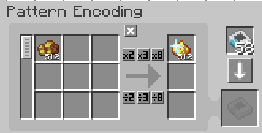
