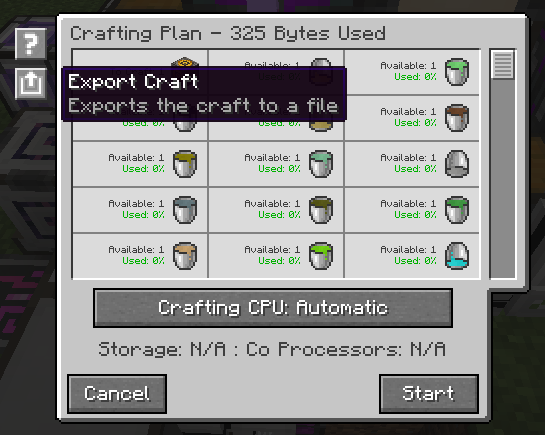
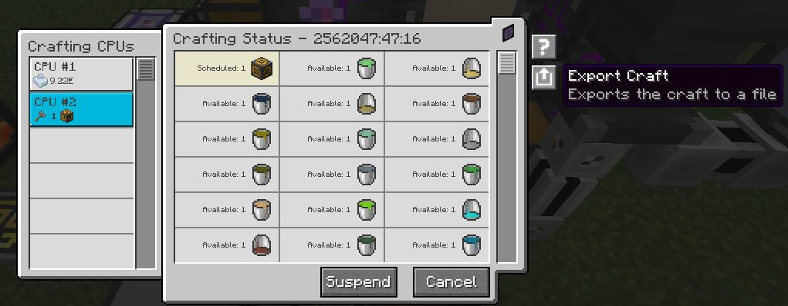

You can now export crafting plans and statuses to json. <br>
On button press, it will save the json file to your computer at the location `$instancePath/ae2/exports/` and will also
send you a message in chat where you can click on the file name to open it directly. <br>
This can be useful for scripting, or maybe in the future, a discord bot that allows to overview your crafts. <br>
Expand the tabs below to see the examples. <br>


??? "Crafting Status export example"
    ```json
    {
      "status": {
        "elapsedTime": 2128171600,
        "remainingItemCount": 2147483647,
        "startItemCount": 2147483647,
        "suspended": false
      },
      "entries": [
        {
          "what": "gtceu:spatial_storage_hazard_sign_block",
          "serial": 15,
          "storedAmount": 0,
          "activeAmount": 0,
          "pendingAmount": 1
        },
        {
          "what": "gtceu:naquadria_bucket",
          "serial": 1,
          "storedAmount": 1,
          "activeAmount": 0,
          "pendingAmount": 0
        },
        {
          "what": "gtceu:propene_bucket",
          "serial": 2,
          "storedAmount": 1,
          "activeAmount": 0,
          "pendingAmount": 0
        },
        {
          "what": "gtceu:indium_concentrate_bucket",
          "serial": 3,
          "storedAmount": 1,
          "activeAmount": 0,
          "pendingAmount": 0
        },
        {
          "what": "gtceu:steam_cracked_propene_bucket",
          "serial": 4,
          "storedAmount": 1,
          "activeAmount": 0,
          "pendingAmount": 0
        },
        {
          "what": "gtceu:charcoal_byproducts_bucket",
          "serial": 5,
          "storedAmount": 1,
          "activeAmount": 0,
          "pendingAmount": 0
        },
        {
          "what": "gtceu:severely_hydro_cracked_light_fuel_bucket",
          "serial": 6,
          "storedAmount": 1,
          "activeAmount": 0,
          "pendingAmount": 0
        },
        {
          "what": "gtceu:allyl_chloride_bucket",
          "serial": 7,
          "storedAmount": 1,
          "activeAmount": 0,
          "pendingAmount": 0
        },
        {
          "what": "gtceu:hydro_cracked_ethylene_bucket",
          "serial": 8,
          "storedAmount": 1,
          "activeAmount": 0,
          "pendingAmount": 0
        },
        {
          "what": "gtceu:polyphenylene_sulfide_bucket",
          "serial": 9,
          "storedAmount": 1,
          "activeAmount": 0,
          "pendingAmount": 0
        },
        {
          "what": "gtceu:hypochlorous_acid_bucket",
          "serial": 10,
          "storedAmount": 1,
          "activeAmount": 0,
          "pendingAmount": 0
        },
        {
          "what": "gtceu:sulfuric_nickel_solution_bucket",
          "serial": 11,
          "storedAmount": 1,
          "activeAmount": 0,
          "pendingAmount": 0
        },
        {
          "what": "gtceu:annealed_copper_bucket",
          "serial": 12,
          "storedAmount": 1,
          "activeAmount": 0,
          "pendingAmount": 0
        },
        {
          "what": "gtceu:enriched_bacterial_sludge_bucket",
          "serial": 13,
          "storedAmount": 1,
          "activeAmount": 0,
          "pendingAmount": 0
        },
        {
          "what": "gtceu:xenon_bucket",
          "serial": 14,
          "storedAmount": 1,
          "activeAmount": 0,
          "pendingAmount": 0
        },
        {
          "what": "gtceu:steam_cracked_butane_bucket",
          "serial": 16,
          "storedAmount": 1,
          "activeAmount": 0,
          "pendingAmount": 0
        },
        {
          "what": "gtceu:bacterial_sludge_bucket",
          "serial": 17,
          "storedAmount": 1,
          "activeAmount": 0,
          "pendingAmount": 0
        },
        {
          "what": "gtceu:hydrofluoric_acid_bucket",
          "serial": 18,
          "storedAmount": 1,
          "activeAmount": 0,
          "pendingAmount": 0
        },
        {
          "what": "gtceu:polytetrafluoroethylene_bucket",
          "serial": 19,
          "storedAmount": 1,
          "activeAmount": 0,
          "pendingAmount": 0
        },
        {
          "what": "gtceu:refinery_gas_bucket",
          "serial": 20,
          "storedAmount": 1,
          "activeAmount": 0,
          "pendingAmount": 0
        },
        {
          "what": "gtceu:molten_hsse_bucket",
          "serial": 21,
          "storedAmount": 1,
          "activeAmount": 0,
          "pendingAmount": 0
        },
        {
          "what": "gtceu:severely_steam_cracked_gas_bucket",
          "serial": 22,
          "storedAmount": 1,
          "activeAmount": 0,
          "pendingAmount": 0
        },
        {
          "what": "gtceu:yttrium_bucket",
          "serial": 23,
          "storedAmount": 1,
          "activeAmount": 0,
          "pendingAmount": 0
        },
        {
          "what": "gtceu:potin_bucket",
          "serial": 24,
          "storedAmount": 1,
          "activeAmount": 0,
          "pendingAmount": 0
        },
        {
          "what": "gtceu:indium_tin_barium_titanium_cuprate_bucket",
          "serial": 25,
          "storedAmount": 1,
          "activeAmount": 0,
          "pendingAmount": 0
        },
        {
          "what": "gtceu:molten_ruridit_bucket",
          "serial": 26,
          "storedAmount": 1,
          "activeAmount": 0,
          "pendingAmount": 0
        },
        {
          "what": "gtceu:trinium_bucket",
          "serial": 27,
          "storedAmount": 1,
          "activeAmount": 0,
          "pendingAmount": 0
        },
        {
          "what": "gtceu:tin_alloy_bucket",
          "serial": 28,
          "storedAmount": 1,
          "activeAmount": 0,
          "pendingAmount": 0
        },
        {
          "what": "gtceu:steam_bucket",
          "serial": 29,
          "storedAmount": 1,
          "activeAmount": 0,
          "pendingAmount": 0
        },
        {
          "what": "gtceu:vanadium_gallium_bucket",
          "serial": 30,
          "storedAmount": 1,
          "activeAmount": 0,
          "pendingAmount": 0
        },
        {
          "what": "gtceu:dinitrogen_tetroxide_bucket",
          "serial": 31,
          "storedAmount": 1,
          "activeAmount": 0,
          "pendingAmount": 0
        },
        {
          "what": "gtceu:naquadah_bucket",
          "serial": 32,
          "storedAmount": 1,
          "activeAmount": 0,
          "pendingAmount": 0
        },
        {
          "what": "gtceu:molten_samarium_iron_arsenic_oxide_bucket",
          "serial": 33,
          "storedAmount": 1,
          "activeAmount": 0,
          "pendingAmount": 0
        },
        {
          "what": "gtceu:nitrosyl_chloride_bucket",
          "serial": 34,
          "storedAmount": 1,
          "activeAmount": 0,
          "pendingAmount": 0
        },
        {
          "what": "gtceu:glue_bucket",
          "serial": 35,
          "storedAmount": 1,
          "activeAmount": 0,
          "pendingAmount": 0
        },
        {
          "what": "gtceu:zinc_bucket",
          "serial": 36,
          "storedAmount": 1,
          "activeAmount": 0,
          "pendingAmount": 0
        }
      ]
    }
    ```

??? "Crafting Plan export example"
    ```json
    {
      "cpu": {
        "name": "Automatic",
        "isFollowing": true,
        "availableBytes": 0,
        "coProcessors": 0,
        "usedBytes": 325
      },
      "entries": [
        {
          "what": "gtceu:spatial_storage_hazard_sign_block",
          "missingAmount": 0,
          "storedAmount": 0,
          "craftAmount": 1,
          "availableAmount": 0
        },
        {
          "what": "gtceu:propene_bucket",
          "missingAmount": 0,
          "storedAmount": 1,
          "craftAmount": 0,
          "availableAmount": 9223372036854775807
        },
        {
          "what": "gtceu:naquadria_bucket",
          "missingAmount": 0,
          "storedAmount": 1,
          "craftAmount": 0,
          "availableAmount": 9223372036854775807
        },
        {
          "what": "gtceu:indium_concentrate_bucket",
          "missingAmount": 0,
          "storedAmount": 1,
          "craftAmount": 0,
          "availableAmount": 9223372036854775807
        },
        {
          "what": "gtceu:steam_cracked_propene_bucket",
          "missingAmount": 0,
          "storedAmount": 1,
          "craftAmount": 0,
          "availableAmount": 9223372036854775807
        },
        {
          "what": "gtceu:charcoal_byproducts_bucket",
          "missingAmount": 0,
          "storedAmount": 1,
          "craftAmount": 0,
          "availableAmount": 9223372036854775807
        },
        {
          "what": "gtceu:severely_hydro_cracked_light_fuel_bucket",
          "missingAmount": 0,
          "storedAmount": 1,
          "craftAmount": 0,
          "availableAmount": 9223372036854775807
        },
        {
          "what": "gtceu:allyl_chloride_bucket",
          "missingAmount": 0,
          "storedAmount": 1,
          "craftAmount": 0,
          "availableAmount": 9223372036854775807
        },
        {
          "what": "gtceu:hydro_cracked_ethylene_bucket",
          "missingAmount": 0,
          "storedAmount": 1,
          "craftAmount": 0,
          "availableAmount": 9223372036854775807
        },
        {
          "what": "gtceu:hypochlorous_acid_bucket",
          "missingAmount": 0,
          "storedAmount": 1,
          "craftAmount": 0,
          "availableAmount": 9223372036854775807
        },
        {
          "what": "gtceu:polyphenylene_sulfide_bucket",
          "missingAmount": 0,
          "storedAmount": 1,
          "craftAmount": 0,
          "availableAmount": 9223372036854775807
        },
        {
          "what": "gtceu:sulfuric_nickel_solution_bucket",
          "missingAmount": 0,
          "storedAmount": 1,
          "craftAmount": 0,
          "availableAmount": 9223372036854775807
        },
        {
          "what": "gtceu:annealed_copper_bucket",
          "missingAmount": 0,
          "storedAmount": 1,
          "craftAmount": 0,
          "availableAmount": 9223372036854775807
        },
        {
          "what": "gtceu:enriched_bacterial_sludge_bucket",
          "missingAmount": 0,
          "storedAmount": 1,
          "craftAmount": 0,
          "availableAmount": 9223372036854775807
        },
        {
          "what": "gtceu:xenon_bucket",
          "missingAmount": 0,
          "storedAmount": 1,
          "craftAmount": 0,
          "availableAmount": 9223372036854775807
        },
        {
          "what": "gtceu:steam_cracked_butane_bucket",
          "missingAmount": 0,
          "storedAmount": 1,
          "craftAmount": 0,
          "availableAmount": 9223372036854775807
        },
        {
          "what": "gtceu:bacterial_sludge_bucket",
          "missingAmount": 0,
          "storedAmount": 1,
          "craftAmount": 0,
          "availableAmount": 9223372036854775807
        },
        {
          "what": "gtceu:polytetrafluoroethylene_bucket",
          "missingAmount": 0,
          "storedAmount": 1,
          "craftAmount": 0,
          "availableAmount": 9223372036854775807
        },
        {
          "what": "gtceu:hydrofluoric_acid_bucket",
          "missingAmount": 0,
          "storedAmount": 1,
          "craftAmount": 0,
          "availableAmount": 9223372036854775807
        },
        {
          "what": "gtceu:refinery_gas_bucket",
          "missingAmount": 0,
          "storedAmount": 1,
          "craftAmount": 0,
          "availableAmount": 9223372036854775807
        },
        {
          "what": "gtceu:molten_hsse_bucket",
          "missingAmount": 0,
          "storedAmount": 1,
          "craftAmount": 0,
          "availableAmount": 9223372036854775807
        },
        {
          "what": "gtceu:severely_steam_cracked_gas_bucket",
          "missingAmount": 0,
          "storedAmount": 1,
          "craftAmount": 0,
          "availableAmount": 9223372036854775807
        },
        {
          "what": "gtceu:yttrium_bucket",
          "missingAmount": 0,
          "storedAmount": 1,
          "craftAmount": 0,
          "availableAmount": 9223372036854775807
        },
        {
          "what": "gtceu:indium_tin_barium_titanium_cuprate_bucket",
          "missingAmount": 0,
          "storedAmount": 1,
          "craftAmount": 0,
          "availableAmount": 9223372036854775807
        },
        {
          "what": "gtceu:potin_bucket",
          "missingAmount": 0,
          "storedAmount": 1,
          "craftAmount": 0,
          "availableAmount": 9223372036854775807
        },
        {
          "what": "gtceu:molten_ruridit_bucket",
          "missingAmount": 0,
          "storedAmount": 1,
          "craftAmount": 0,
          "availableAmount": 9223372036854775807
        },
        {
          "what": "gtceu:trinium_bucket",
          "missingAmount": 0,
          "storedAmount": 1,
          "craftAmount": 0,
          "availableAmount": 9223372036854775807
        },
        {
          "what": "gtceu:vanadium_gallium_bucket",
          "missingAmount": 0,
          "storedAmount": 1,
          "craftAmount": 0,
          "availableAmount": 9223372036854775807
        },
        {
          "what": "gtceu:steam_bucket",
          "missingAmount": 0,
          "storedAmount": 1,
          "craftAmount": 0,
          "availableAmount": 9223372036854775807
        },
        {
          "what": "gtceu:tin_alloy_bucket",
          "missingAmount": 0,
          "storedAmount": 1,
          "craftAmount": 0,
          "availableAmount": 9223372036854775807
        },
        {
          "what": "gtceu:dinitrogen_tetroxide_bucket",
          "missingAmount": 0,
          "storedAmount": 1,
          "craftAmount": 0,
          "availableAmount": 9223372036854775807
        },
        {
          "what": "gtceu:naquadah_bucket",
          "missingAmount": 0,
          "storedAmount": 1,
          "craftAmount": 0,
          "availableAmount": 9223372036854775807
        },
        {
          "what": "gtceu:molten_samarium_iron_arsenic_oxide_bucket",
          "missingAmount": 0,
          "storedAmount": 1,
          "craftAmount": 0,
          "availableAmount": 9223372036854775807
        },
        {
          "what": "gtceu:nitrosyl_chloride_bucket",
          "missingAmount": 0,
          "storedAmount": 1,
          "craftAmount": 0,
          "availableAmount": 9223372036854775807
        },
        {
          "what": "gtceu:glue_bucket",
          "missingAmount": 0,
          "storedAmount": 1,
          "craftAmount": 0,
          "availableAmount": 9223372036854775807
        },
        {
          "what": "gtceu:zinc_bucket",
          "missingAmount": 0,
          "storedAmount": 1,
          "craftAmount": 0,
          "availableAmount": 9223372036854775807
        }
      ]
    }
    ```