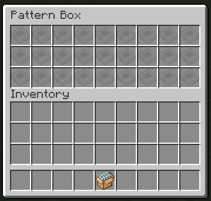
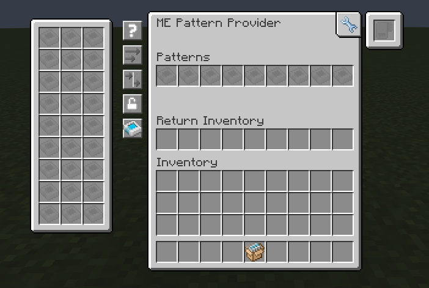

### Shift click patterns into the access terminal into either the first accessible slot or if a specific provider has been focused with search, into that one

### Shift click patterns to inventory when encoding: If you press shift while encoding a pattern, it will put itself into your inventory instead of the output slot.

### Pattern box: gives you an easy way to carry around all your patterns instead of having to keep them all over your inventory or backpacks.  

### This conveniently also adds a floating inventory to most menu screens, so you can quickly access the aforementioned patterns.  

### Stackable patterns  

### Encoded pattern tooltips now look better, and they show who encoded the pattern  

### And optionally show the icons of the encoded stack, opt-out via config  

### New encoded pattern textures!

|        Pattern         |                                       Texture                                        |
|:----------------------:|:------------------------------------------------------------------------------------:|
|    Crafting Pattern    |                |
|   Processing Pattern   |            |
|    Smithing Pattern    |    |
|  Stonecutting Pattern  |        |