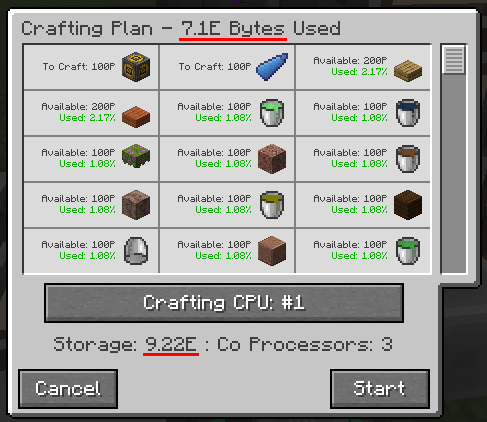
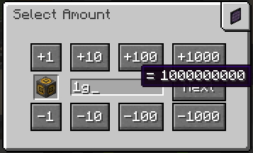
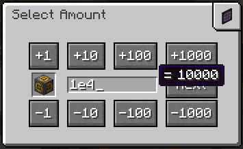
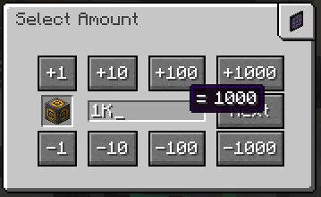
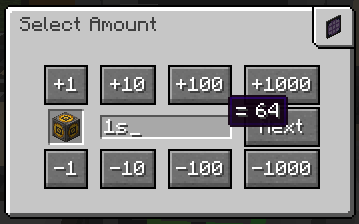
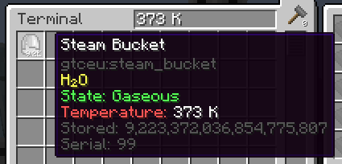
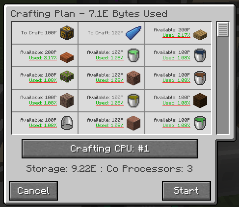
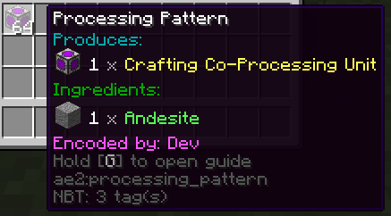
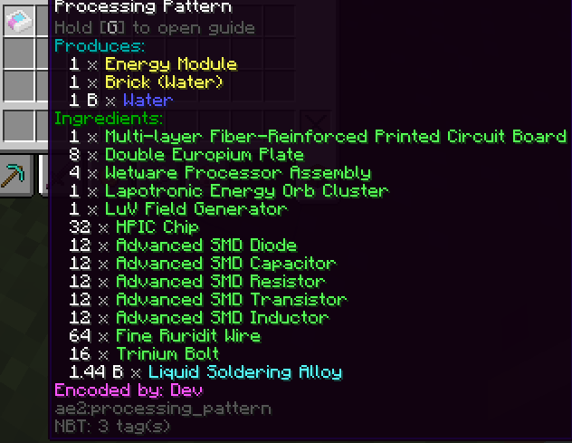
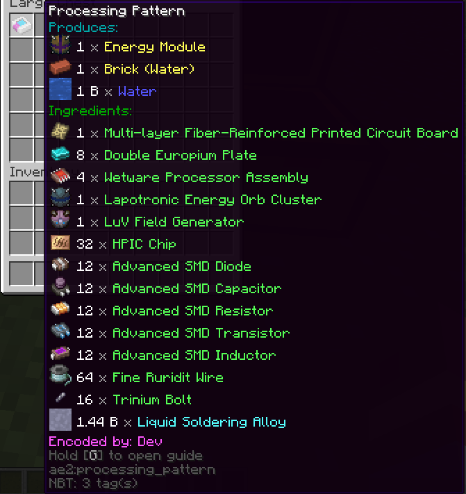

Format higher amounts better in random places: 1000 → 1 K,

Better math expression parsing to most screens, si units, exponents, scientific notation all support,
valid examples: 1e4, 1g, 1K, 1s(stack/64) etc..

# Section A

Shift click patterns into the access terminal

Search bar now also searches tooltips  

Show percentage used per stack in the craft confirm screen

Stackable patterns  

encoded pattern tooltips now look better, show who encoded the pattern,
and optionally show the icons of the encoded stack, opt-out via config  

Shift click patterns to inventory when encoding